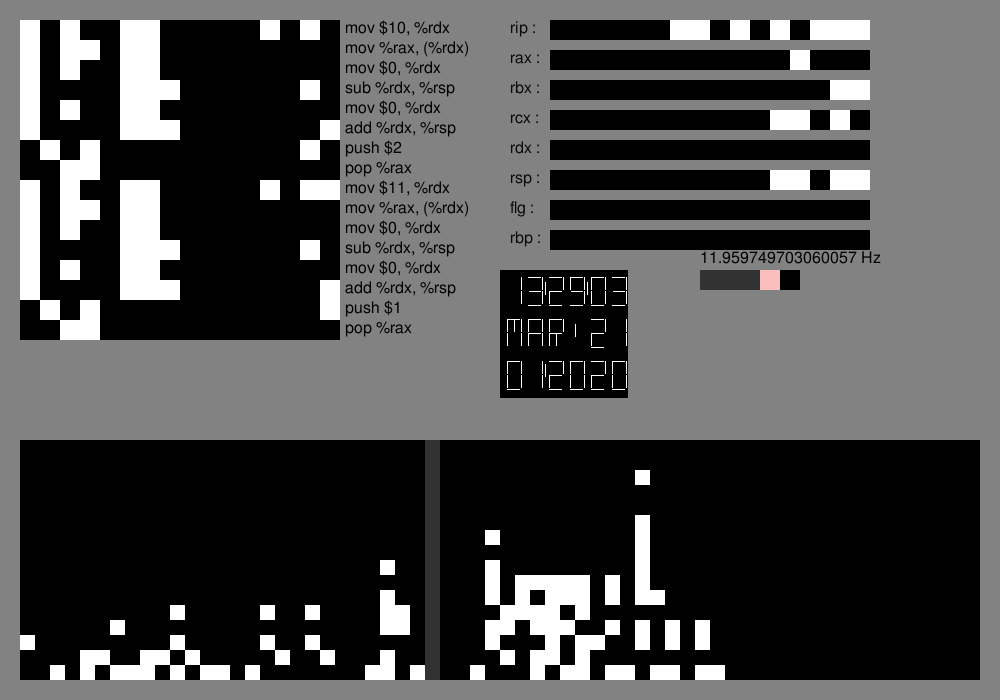
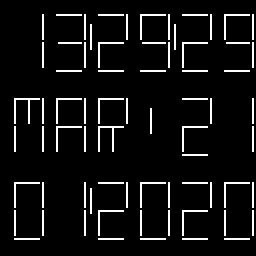

# MicroProcessor

## Introduction
This is a microprocessor written in Python for my L3 course "Systèmes Numériques".  
It's a 16bits processor with 8 registers, a ROM of fixed size (length of the code) and a RAM that can be used during the excecution of the program.  

With my group we also wrote a compiler from mini-Kotlin to ASM that this microprocessor can run.  

We tried this on a simple clock. 

## How to test it
### Requirements
 
```
pip3 install pygame
pip3 instal lark
```

### Debug mode

```
python3 main.py --debug -ram 64
```

  
* top-left : the ROM (a part of it only, press key top/down arrow to see all of it)
* top-right : registers
* bottom : the RAM (press the left/right arrow to navigate)
* middle : the 128x128 LCD screen

We can start the execution by pressing the spacebar. 
We can change the speed (very slow, slow, max speed) but it's not that fast. Instead we
compiled the microprocessor in C++ (as main.cpp) and compiled this C++ code with optimization flags. 

### Speed mode
```
./main | python3 main.py --clock
```
  
It's a lot faster. 